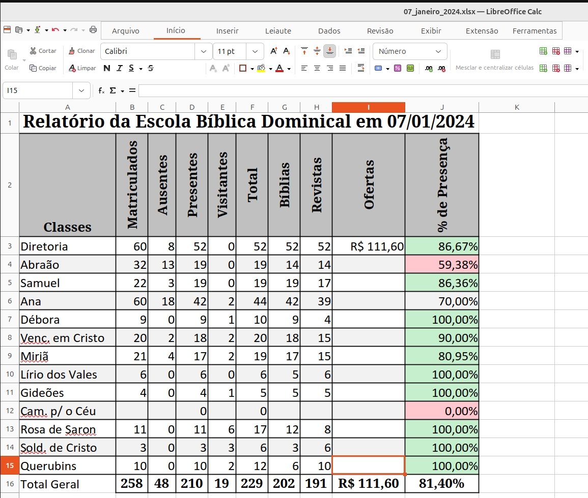
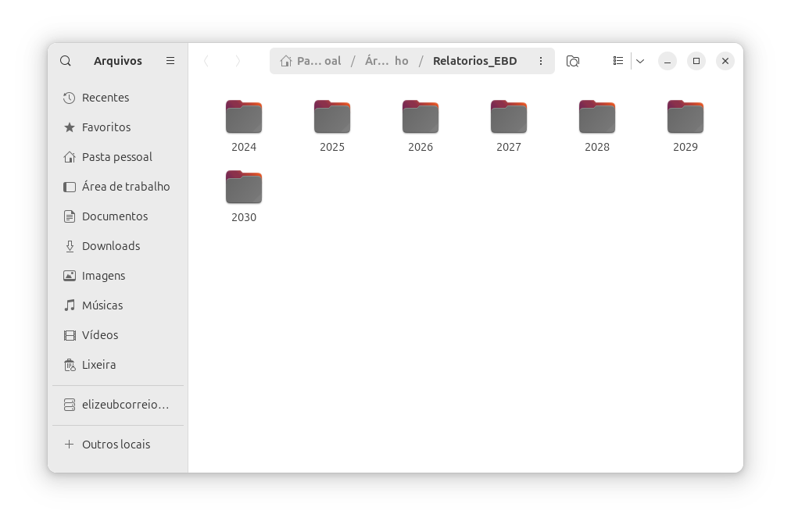
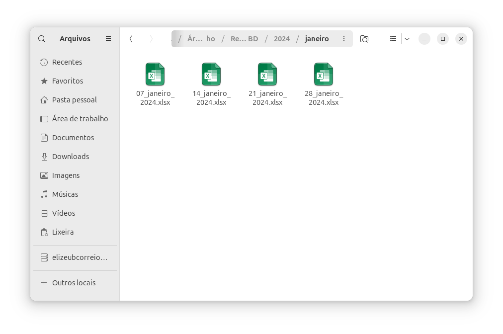
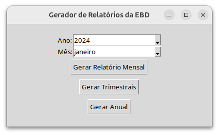

# Sistema de Relatório para Escola Bíblica Dominical

**Toda a honra e glória a Deus eternamente!**

## O que este sistema Faz?

Este Sistema gera várias planilhas do excel automaticamente e também gera Relatórios Mensais, Trimestrais e Anual da EBD e tem por finalidade substituir o livro de relatório físico. Basicamente o sistema irá criar um Diretório nomeado **Relatorios_EBD**, – talvez será necessário criar este diretório na mesma pasta de execução do criador de planilhas manualmente – e dentro deste diretório, irá gerar diversos diretórios organizados por ano, mês e planilhas para cada domingo. 





### Sistema de diretórios criados pelo script:



### Tela do Software e Relatórios gerados




## Configurações

Existem mais de uma forma de utilizar este sistema. Caso queira mudar alguns detalhes no sistema utilizando python, o requerimento é ter o Python instalado no sistema. Também será necessário criar um ambiente de variável (.env) e instalar os requerimentos com o comando ```pip install -r requirements.txt```.

### Configuração das Classes

Lembre-se de substituir a lista de classes pela de sua escola:

- Edite o arquivo **classes.txt**

### Formas de Utilização

1. Utilizando o **Jupyter Notebook** ou o Vs Code com a extensão Jupyter para rodar o arquivo [gerando_diretorios_e_planilhas.ipynb](gerando_diretorios_e_planilhas.ipynb)

3. Rodando os scripts via terminal: ```python3 gera_planilhas.py```(Gera as planilhas para preenchimento) e ```python3 gerador_relatorio_GUI.py ``` (Para gerar os Relatórios mensais, trimestrais e anuais).

4. Utilizando o executáveis *.exe (caso esteja usando Windows).

## Criação do executável

Para melhorar a usabilidade, e os executáveis não funcione, você pode criar os executáveis utilizando o *auto-py-to-exe*.
- Digite ```auto-py-to-exe ``` e siga a instrução no browser.

## Muito Obrigado e deixe uma estrela se este sistema for útil.