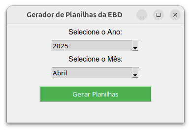

# Sistema de Relatório para Escola Bíblica Dominical

## O que este sistema Faz?

Este Sistema gera várias planilhas do excel automaticamente e também gera Relatórios Mensais, Trimestrais e Anual da EBD e tem por finalidade substituir o livro de relatório físico. Basicamente o sistema cria um Diretório nomeado **Relatorios_EBD** e dentro deste diretório gera diversos diretórios organizados por ano, mês e planilhas para cada domingo. 




### Sistema de diretórios criados pelo script:


### Tela do Software e Relatórios gerados


## Utilização do sistema

Existem mais de uma forma de utilizar este sistema. O requerimento é ter o Python instalado no sistema. Também será necessário criar um ambiente de variável (.env) e instalar os requerimentos com o comando ```pip install -r requirements.txt```.

## Lembrete

Lembre-se de substituir a lista de classes pela de sua escola:
```
CLASSES = [
    "Diretoria", "Abraão", "Samuel", "Ana", "Débora", "Venc. em Cristo",
    "Miriã", "Lírio dos Vales", "Gideões", "Cam. p/ o Céu",
    "Rosa de Saron", "Sold. de Cristo", "Querubins"
]
```

1. Utilizando o **Jupyter Notebook** ou o Vs Code com a extensão Jupyter para rodar o arquivo [gerando_diretorios_e_planilhas.ipynb](gerando_diretorios_e_planilhas.ipynb)

3. Rodando os scripts via terminal: ```python3 gera_planilhas.py```(Gera as planilhas para preenchimento) e ```python3 gera_relatorio_ebd.py ``` (Para gerar os Relatórios mensais, trimestrais e anuais).

4. Com interface gráfica iniciada via terminal: ```python3 gerador_planilhas_GUI.py ``` e ``` python3 gerador_relatorio_gui.py```.

## Criação do executável

Para melhorar a usabilidade, você pode criar os executáveis utilizando o *auto-py-to-exe*.
- Digite ```auto-py-to-exe ``` e siga a instrução no browser.

## Muito Obrigado e deixe uma estrela se este sistema for útil.